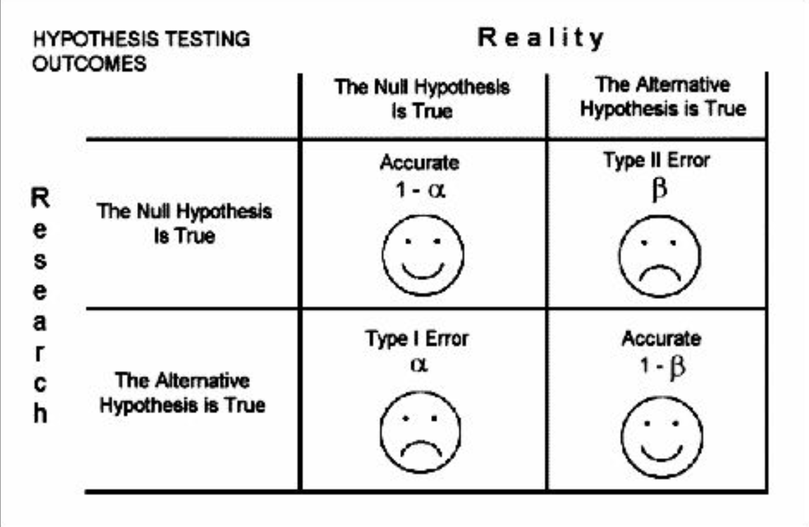

```{r setup, include=FALSE}
knitr::opts_chunk$set(echo = TRUE)
```

##Quiz Review
###Function Q
For someFunction(x):
```{r}
someFunction <- function(x) {
  y = x^2;
  return(y)
}
```
Argument can be numeric or logical. TRUE = 1, FALSE = 0, so you can still get a numeric value from logicals.

Side note: a factor is a data type which a reference to a memory slot. You can have a vector of factors (1, 2, 3) which point to some objects red, blue, green.

###What if we have the wrong data type?
R can *coerce* data types as necessary.

Or you can do it manually using "as" functions:
<br />-as.numeric()
<br />-as.factor()
<br />-as.character()
<br />-as.logical()

###Scatterplot Q
Minimum input for scatterplot is just 1 vector since R is intuitive. For one vector, R will plot the element with the index number.
R is smart: plot(), hist(), barplot() can all take a single vector as input to graph

###P-value Q
p-value: the probability that you can accept the null hypothesis.
<br />Null hyp: sea creature = sphaget monster (there is not a significant difference)
<br />Alt hyp: sea creature =/= sphaget monster (there is significant difference)

Less than .05: 
<br />-There *is* a significant difference
<br />-You can reject the null hypothesis
<br />-Accept the alt hypothesis
<br />-sea creature =/= sphaget monster

Greater than .05:
<br />-There *is not* a significant difference
<br />-You can accept null hypothesis
<br />-Reject alt hypothesis
<br />-sea creature = sphaget monster

##Statistics Review
https://bioboot.github.io/bimm143_W18/class-material/lecture16_BIMM143_W18-large.pdf
Variance: how much data varies, square root of SD
<br />SD: standard deviatiion, standard measure of dispersion
<br />-note that adjusted sample variance/SD divides by (n-1) so that it is on the same scale as mean
<br />-leads to more accurate estimation of population variance
<br />-recognized as unbiased

Calculate SD and variance
```{r}
x = c(5, 6, 4, 6, 5)
y = c(2, 10, 7, 3, 5)
x10 = 10*c(5, 6, 4, 6, 5)
sd(x)
# 2 ways to do variance
var(x)
(sd(x))^2
```
Ex: Variance in PC
What happens when I scale measurements from 0 --> 100 to 0 -->1? (mean: 50, .5)
<br />-Variance also decreases
<br />-If variance was 30, it becomes .3

How does scaling measurements allow for a better comparison of the variances between principal components?

##Probability Distributions
```{r}
mean = 5
sd = 2
graph <- rnorm(1:500, mean = mean, sd = sd)
hist(graph)
abline()
```

Use pnorm to calculate probability that x is between 2 and 6 if mean =5 and sd = 2
```{r}
#normal distribution between 2 and infinity?
pnorm(2, mean = 5, sd = 2)
pnorm(6, mean = 5, sd = 2)
```


Building a function to plot the normal distribution.
<br /> Recall that exp(x) gives you e^x
<br /> Recall that pi is a built-in value
```{r}
x = c(1:100)
mean = 50
sd = 10
coolnorm <- function(x,mean,sd){
#Write your body here (Use the equation from the previous slide)
  a = 1/(sd * sqrt(2*pi))
  b = -(x-mean)^2/(2*sd^2)
  
  y = a*exp(b)
return(y)
}
plot(coolnorm(x,mean,sd))
```

##Why might it be useful to model our data using the normal distribution?
Data in nature seems to be distributed this way. This standardized curve makes it easier to compare data and generate other values like z-value.

##What are some obstacles to building a normal distribution from our data?
Not *all* data is distributed this way. If you have a small sample, the data may not be distributed normally.

##If sample size is small, use t-distribution
T-distribution accurately estimates the shape of probability distribution. It tends toward the normal distribution when sample size is large.
<br /> Small sample size is usually <30
<br />v = degrees of freedom, which can be n-1 but it can also be calculated with alt methods

Plot probability from a t-distribution:
```{r}
x <- seq(-4, 4, length=100)
hx <- 
dnorm(x)
degf <- c(1, 3, 8, 30)
colors <- c("red", "blue", "darkgreen", "gold", "black")
labels <- c("df=1", "df=3", "df=8", "df=30", "normal")
plot(x, hx, type="l", lty=2, xlab="x value",
  ylab="Density", main="Comparison of t Distributions")
for (i in 1:4){
  lines(x, 
dt(x,degf[i])
, lwd=2, col=colors[i])
}
legend("topright", inset=.05, title="Distributions", labels, lwd=2, lty=c(1, 1, 1, 1, 2), col=colors)
```
##Z-Test
Used to compare >30 sample sizes to a normally distributed population
<vr />-One-sample t-test: Used to compare a population mean to a t-distributed set of sample measurements. Shows distribution of sample, not population
<br />Two-sample t-test: The statistic and the t-distribution is used to compare 2 sets of sample measurements (n< 30)
<br />ANOVA: Used to compare 2+ normally distributed sets of measurements with similar SD

Try it out z-test using the TeachingDemo package:
```{r}
library(TeachingDemos)
mean = 4.5
sd = .2
x1 = rnorm(31, mean = mean, sd=sd)
# z.test(x, mean = , sd = )
z.test(x1,mu=3, .5)

# extract p.value
#z.test$p.value
```

Try out one-sample t-test:
```{r}
x1 = c(2, 3, 2.4)
x1.t <- t.test(x1, mean = 4)
x1.t
```

Try out two-sample t-test:
```{r}
x1 = c(2, 3, 2.4)
x2 = c(4, 5, 8)
t.test(x1, x2)
```

Try with different data set
```{r}
Test1 = t.test(c(8, 12, 9, 11), c(18, 19, 22, 21))
Test2 = t.test(c(8, 12, 9, 11), c(12, 12, 12))
Test1
Test2
```
In which test can we reject the null?
<br /> Test1 you can reject the null hypothesis. The two vectors are significantly different because p-value is <.05. The p-value for Test2 is >.05, so we can't reject the null.

Which shows significant difference?
<br /> Test1 shows significant differnece


##Try with real data
```{r}
controlMC <- t.test(c(24.75924, 26.98667, 24.94788, 27.73277, 26.32180, 24.33580, 23.93787), c(25.53444, 29.59317, 27.64380, 24.93487, 28.18750, 28.66826, 25.12095))

controlSTM <- t.test(c(30.20258, 24.95905, 22.94211, 27.28486, 25.69725, 25.14251, 15.00047), c(20.71227, 25.36827, 27.51740, 24.15624, 24.58701, 25.95468, 21.62241))

musicMC <- t.test(c(30.34595, 26.44569, 24.20254, 27.93985, 27.55459, 28.06074), c(26.18530, 25.45878, 27.88757, 27.77321, 24.92148, 26.81723))

musicSTM <- t.test(c(25.28486, 24.88745, 25.00814, 27.31849, 24.26051, 27.03386), c(24.23587, 23.61379, 24.64021, 25.79427, 21.92580, 28.31796))
  

preVGMC <-c(27.04761, 27.04171, 28.94454, 26.86962, 25.55325, 27.40797, 26.10106)
postVGMC <-c(30.00503, 29.29816, 27.00058, 28.77350, 29.11423, 30.94159, 28.30345)
gameMC <- t.test(preVGMC, postVGMC)

gameSTM <- t.test(c(25.56566, 22.69519, 23.73103, 22.05665, 20.80492, 25.96523, 17.07626), c(28.35187, 29.37445, 25.75735, 21.65600, 27.92469, 24.79261, 23.83318))
```

##Types of Errors


##Calculating t-test power
Power: fraction of true positives that will be detected. Value between 1 and 0. The larger the sample size, the larger the power.
<b />The probability that you can reject the null hypothesis when it's false

Use R packages pwr or power.t.test
```{r}
library(pwr)
#power.t.test(n, delta, sd , sig.level, power, type, alternative)
power.t.test(11, sd =1, power =.9, type = "two.sample",  alternative = "two.sided")

# Find what sample size is necessary for power = .9?
#power.t.test(11, sd =1, power =.9, type = "two.sample",  alternative = "two.sided")
```

Some Q's
<br />1. Effect size is small?
<br />
<br />2. Why would you want to adjust false discovery rate?
<br />Adjust for how accurate you want it to be (number of false positives against sample size)
<br />3. Power gives you the power to do what?
<br />Detect false positives, probability to reject the null hypothesis when it's false
